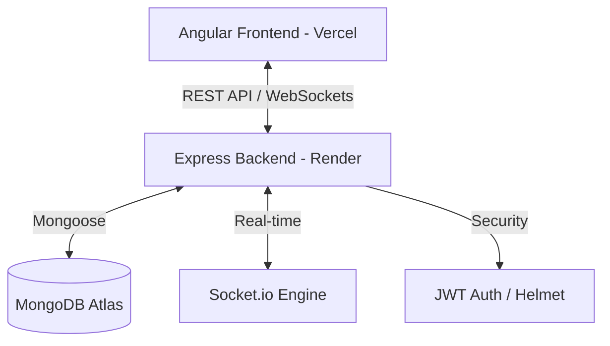

# 🌍 WasteZero: Smart Waste Management Ecosystem

[](https://zero-waste-s1td.vercel.app)
[](https://wastezero-backend-gv0w.onrender.com)
[](https://opensource.org/licenses/MIT)

**Clean Cities Start With One Request.**  
WasteZero is a high-performance, full-stack waste pickup and recycling platform designed to connect environmentally conscious citizens with dedicated volunteers. Built with the MERN stack and Angular, it streamlines the journey from waste request to recycled impact.

---

## 🚀 Key Features

### 👤 For Citizens (Users)
*   **Smart Scheduling**: Book waste pickups in under 60 seconds with a streamlined form.
*   **Real-time Tracking**: Monitor the status of your requests from "Pending" to "Collected".
*   **Impact Dashboard**: Visualize your personal contribution to recycling and environmental health.
*   **Direct Messaging**: Communicate directly with assigned volunteers to coordinate pickups.

### 🤝 For Volunteers (Pickup Agents)
*   **Opportunity Portal**: Browse and accept available pickup requests in your local area.
*   **Status Management**: Update pickup progress in real-time, notifying users instantly.
*   **Volunteer Analytics**: Track your completed assignments and total waste recycled.

### 🛡️ For Administrators
*   **Command Center**: Oversee the entire ecosystem with a comprehensive dashboard.
*   **User Management**: Manage roles, permissions, and account status for all platform members.
*   **Intelligent Reporting**: Generate and download detailed CSV/PDF reports on platform activity and recycling metrics.

---

## 🛠️ Technology Stack

| Layer | Technology |
| :--- | :--- |
| **Frontend** | Angular 17+, TypeScript, Vanilla CSS (Premium Custom Design) |
| **Backend** | Node.js, Express.js |
| **Database** | MongoDB Atlas |
| **Real-time** | Socket.io (Instant Notifications & Messaging) |
| **Security** | JWT Authentication, Bcrypt, Helmet.js |
| **Hosting** | Vercel (Frontend), Render (Backend) |

---

## 🏗️ System Architecture



---

## 📦 Installation & Setup

### Prerequisites
*   Node.js (v18+)
*   MongoDB Atlas Account
*   Angular CLI (`npm install -g @angular/cli`)

### Backend Setup
1. Navigate to `wastezero-backend`
2. Install dependencies: `npm install`
3. Create a `.env` file:
   ```env
   PORT=5000
   MONGO_URI=your_mongodb_uri
   JWT_SECRET=your_secret
   FRONTEND_URL=http://localhost:4200
   ```
4. Start server: `npm start`

### Frontend Setup
1. Navigate to `wastezero-frontend`
2. Install dependencies: `npm install`
3. Start development server: `ng serve`
4. Access at `http://localhost:4200`

---

## 🌐 Deployment Configuration

This project is optimized for modern cloud hosting:

### Render (Backend)
*   **Build Command**: `npm install`
*   **Start Command**: `node server.js`
*   **Env Vars**: `MONGO_URI`, `JWT_SECRET`, `FRONTEND_URL`

### Vercel (Frontend)
*   **Framework Preset**: `Angular`
*   **Root Directory**: `wastezero-frontend`
*   **Output Directory**: `dist/wastezero-frontend/browser`

---

## 📄 License
Distributed under the MIT License. See `LICENSE` for more information.

---

<p align="center">
  Developed with ❤️ for a Greener Future.
</p>